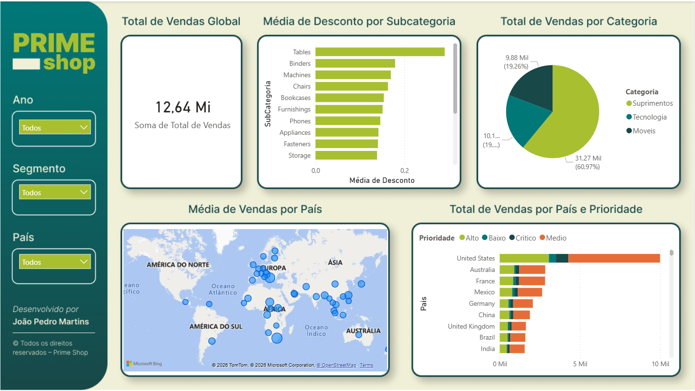
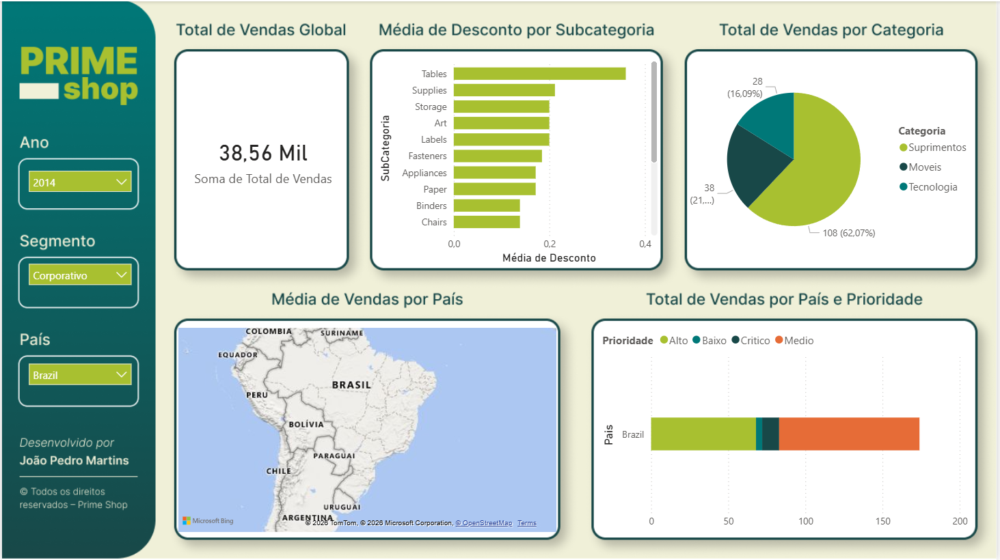
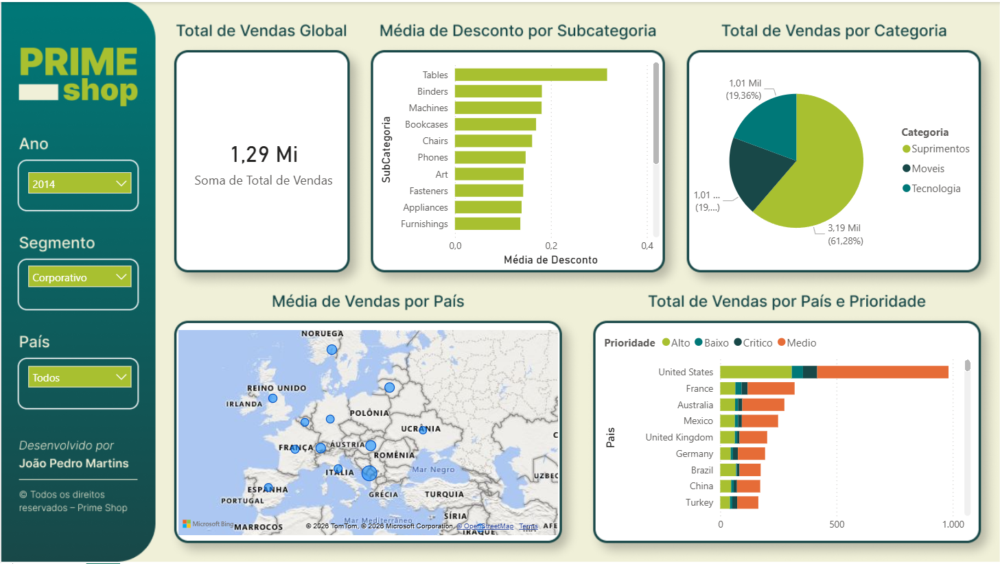
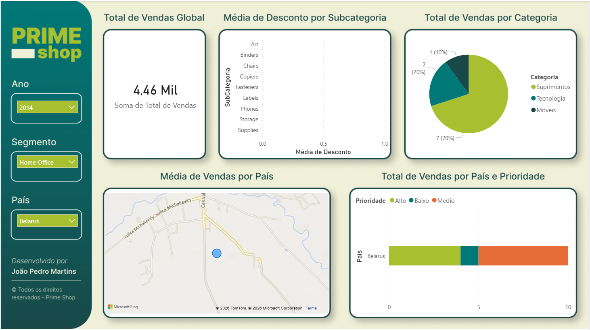
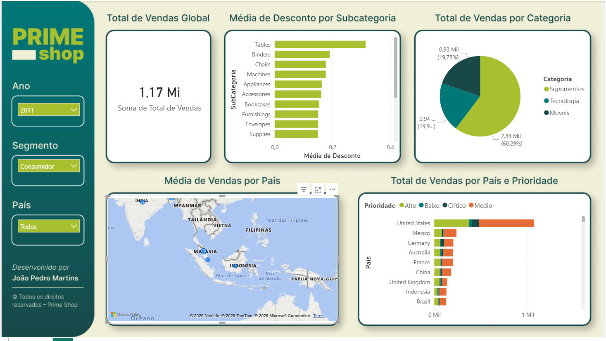

# 📊 Power BI – Dashboard de Vendas Globais

## 📌 Sobre o Projeto

Este projeto faz parte do **Lab 1 do curso Microsoft Power BI para Business Intelligence e Data Science**, oferecido pela **Data Science Academy**.

O objetivo foi desenvolver um **dashboard interativo no Power BI** a partir de um **dataset de vendas de uma empresa fictícia com atuação global**, explorando métricas relevantes de negócio e boas práticas de visualização de dados.

---

## 🎯 Objetivos de Negócio

O dashboard foi construído para responder às seguintes perguntas:

* Qual o **valor total vendido**?
* Quantas **vendas foram realizadas por categoria de produto**?
* Quantas **vendas foram realizadas por país**, considerando a **prioridade de entrega**?
* Qual foi a **média de desconto** aplicada nas vendas por **subcategoria de produto**?
* Quais países apresentaram a **maior média de valor de venda**, demonstrado em um **mapa geográfico**?

---

## 🔎 Funcionalidades do Dashboard

O usuário pode explorar os dados de forma dinâmica por meio de **filtros interativos**, permitindo segmentações por:

* Ano
* Segmento
* País

Esses filtros possibilitam análises sob diferentes perspectivas e facilitam a interpretação dos dados.

---

## 🛠️ Tecnologias e Ferramentas

* Microsoft Power BI
* Modelagem de Dados
* Visualizações Interativas
* Análise de Métricas de Vendas

---

## 🚀 Aprendizados

* Construção de dashboards orientados a perguntas de negócio
* Uso de filtros e segmentações no Power BI
* Análise exploratória de dados de vendas
* Visualização de dados geográficos

---

## 📎 Observações

Este projeto tem caráter **educacional** e utiliza dados **fictícios**, sendo parte do processo de desenvolvimento de um portfólio em **Business Intelligence e Análise de Dados**.

---

Perfeito. Segue uma **seção pronta para README de GitHub**, escrita especificamente para **acomodar prints do dashboard**, com tom profissional e padrão de portfólio.

Você pode colar exatamente como está e inserir as imagens depois.

---

## 🖼️ Exemplos do Dashboard

Abaixo estão alguns **prints do dashboard desenvolvido no Power BI**, destacando as principais análises, KPIs e recursos interativos implementados ao longo do projeto.

📹▶️ Para ver um vídeo do dashboard em seu funcionamento pleno, clique abaixo:

[Demonstração do Dashboard no Power BI](https://youtu.be/l3Nf0JL0DII)

    

    

    

    

    

